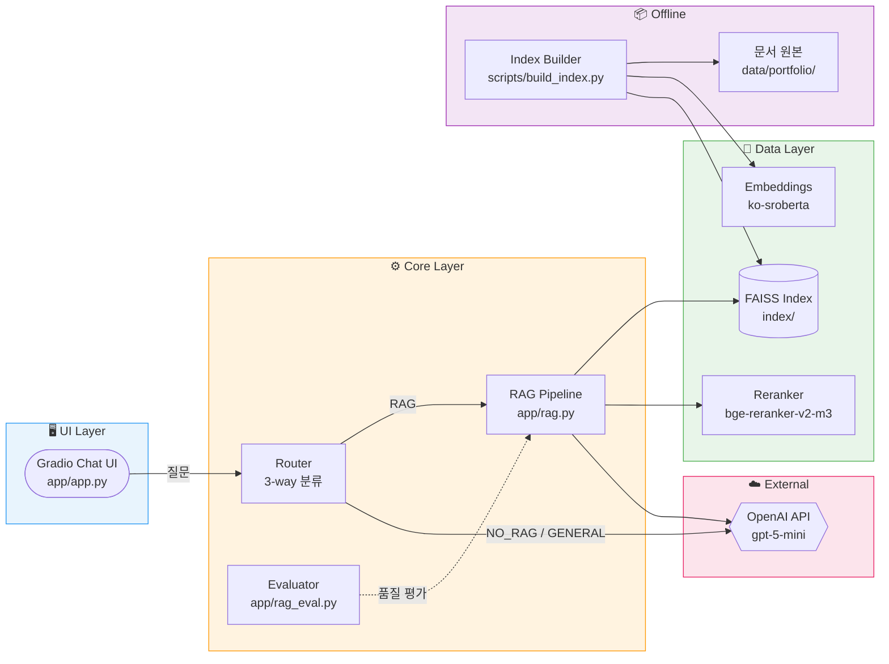
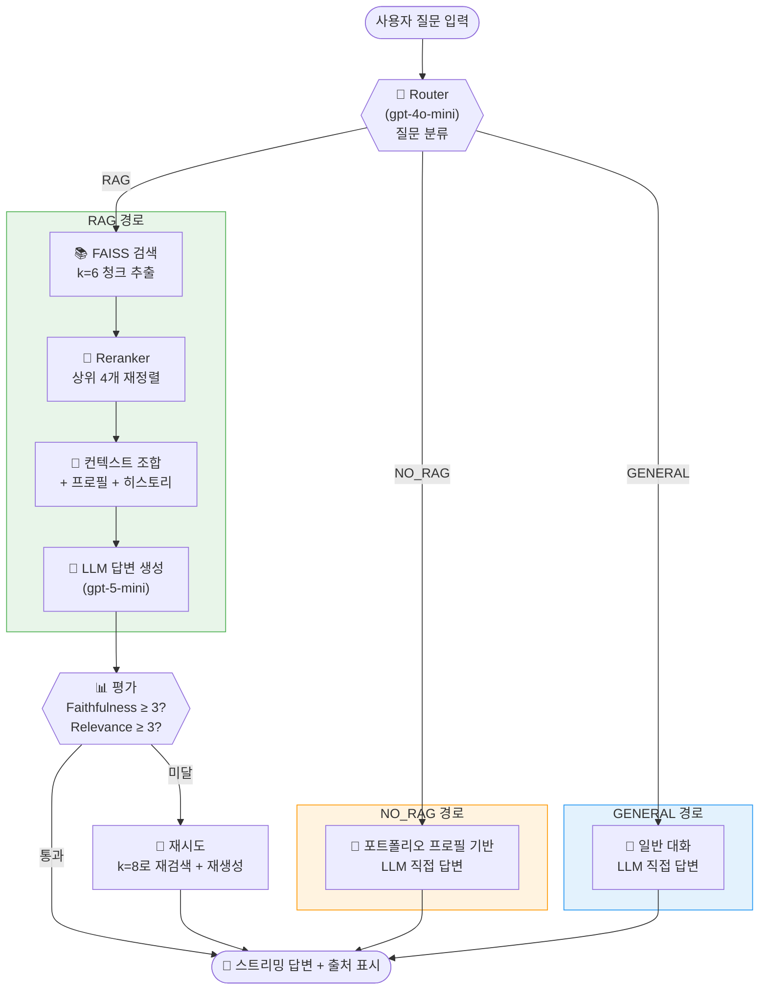
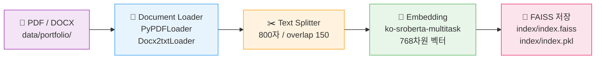
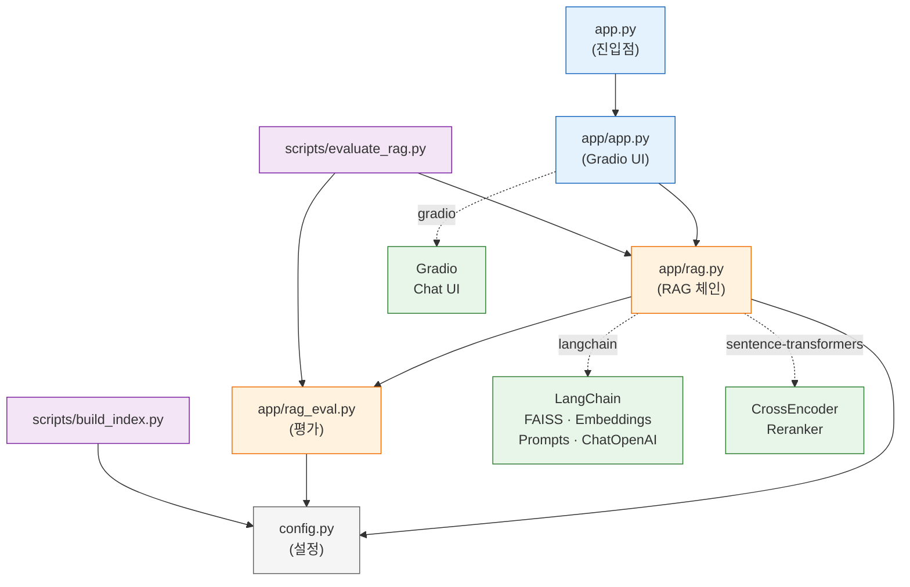

# 포트폴리오 RAG 에이전트 — 개발 메모

> 개발 시 참고용 결정사항 정리. 바이브 코딩으로 진행하는 포폴 전용 에이전트 프로젝트.

---

## 1. 목표·대상·용도

| 항목 | 내용 |
|------|------|
| **목표** | 인사팀이 포트폴리오와 대화하면서 후보자를 빠르게 파악 + LLM 설계 능력 어필 |
| **대상** | 포폴을 보는 인사팀 실무자 |
| **용도** | "이 사람이 뭘 할 수 있는지", "어떤 프로젝트/역할인지" 빠르게 파악 |

---

## 2. 제약(Constraints)

| 항목 | 결정 |
|------|------|
| **임베딩** | 로컬 임베딩 (API 비용 없음, 데이터 외부 전송 없음) |
| **언어** | 한국어 위주 |
| **문서 규모** | 5~10개 수준 (PDF + Word 다양하게) |
| **비용** | 무료 위주 (HF Spaces, 로컬 임베딩) |
| **LLM** | 사용자 OpenAI API Key 사용 (답변 생성만) |

---

## 3. 문서·데이터

| 항목 | 내용 |
|------|------|
| **형식** | PDF, Word 모두 지원 |
| **위치** | `data/portfolio/` 에 PDF·DOCX 배치 |
| **로더** | LangChain **PyPDFLoader** (PDF), **Docx2txtLoader** (Word) |

---

## 4. RAG 스택

| 단계 | 선택 | 비고 |
|------|------|------|
| **문서 로더** | LangChain `PyPDFLoader`, `Docx2txtLoader` | PDF: pypdf, Word: docx2txt |
| **청킹** | **RecursiveCharacterTextSplitter** | chunk_size / chunk_overlap 등 설정 필요 |
| **임베딩** | **jhgan/ko-sroberta-multitask** | 로컬, 한국어 최적화 |
| **벡터 DB** | **FAISS** | 인덱스 파일로 저장 → HF에 포함 배포 |
| **LLM** | **OpenAI API** (사용자 API Key) | 답변 생성용 |
| **라우팅** | 포폴 관련 여부 1회 LLM 판별 | 관련 없으면 RAG 생략, LLM만 사용 (인사/일상 등) |
| **대화 히스토리** | 최근 5턴(10메시지)을 LLM에 전달 | `MessagesPlaceholder("chat_history")` 로 이어서 답변 |
| **RAG 평가** | 별도 모듈·스크립트 | §4-1 참고 |

---

## 4-1. RAG 평가 (쿼리·참고 문단·답변 품질)

쿼리에 맞는 포트폴리오를 참고해 적절히 답했는지 **따로** 평가할 때 사용.

| 항목 | 내용 |
|------|------|
| **위치** | `app/rag_eval.py`, `scripts/evaluate_rag.py` |
| **지표** | **Faithfulness(충실도)**: 답변이 참고 문단에만 기반하는가(지어내지 않았는가) 1~5점 |
| | **Relevance(적합성)**: 질문에 맞는 답변·참고 문단인가 1~5점 |
| **방식** | LLM-as-judge (평가용 프롬프트로 한 번 더 호출) |
| **사용** | `evaluate_response(query, context, answer)` 또는 `evaluate_response_from_docs(query, source_docs, answer)` |
| **스크립트** | `uv run python scripts/evaluate_rag.py` → 샘플 쿼리로 RAG 호출 후 각각 평가·요약 출력 |

평가는 채팅 UI와 분리되어 있으며, 로그/샘플 쿼리로 나중에 돌리거나 배치로 돌릴 때 사용.

---

## 4-2. 체인에 넣을 만한 시나리오 (확장 아이디어)

지금 흐름: **라우팅 → 검색(FAISS) → 프롬프트+LLM → 답변**. 여기에 더 붙이거나 바꿀 수 있는 단계들.

| 시나리오 | 뭔지 | 넣었을 때 효과 |
|----------|------|----------------|
| **쿼리 보정/확장** | 질문을 검색에 유리하게 한 번 고치거나, 동의어·하위 질문 추가 | 짧은 질문("강점?")을 "이 사람의 강점, 역량, 차별화 포인트"처럼 풀어서 검색 품질 향상 |
| **리랭킹(Re-ranking)** | 검색으로 뽑은 k개 청크를 한 번 더 순서 매기기 (작은 모델/점수로) | 상위 4개가 질문과 더 맞는 순으로 정렬 → 답변 품질·Faithfulness 개선 |
| **하이브리드 검색** | 벡터 검색 + 키워드(BM25) 결과를 합치거나 앙상블 | "2023년 OO 프로젝트"처럼 연도·이름이 중요할 때 보완 |
| **멀티 쿼리** | 질문에서 파생 질문 2~3개 만들어 각각 검색 후 문맥 합침 | 한 질문으로 여러 각도 문단을 가져와 놓침 감소 |
| **의도별 프롬프트** | "요약형 / 비교형 / 연대기형" 등 의도 분류 후 프롬프트 분기 | 질문 유형에 맞는 답 형식(리스트, 표, 문단)으로 생성 |
| **답 정제(Refinement)** | 1차 답변을 받은 뒤 "더 짧게" / "인사용 톤으로" 한 번 더 생성 | 톤·길이 통일, 불필요한 반복 제거 |
| **검색 전 캐시** | 대화 히스토리에서 이미 답한 내용이 있으면 검색 생략·요약 반환 | 비용·지연 감소, 일관된 답 유지 |
| **평가 후 재시도** | 답 생성 후 Faithfulness/Relevance 낮으면 k 늘리거나 쿼리 바꿔 재검색·재생성 | 품질이 안 나온 경우만 한 번 더 시도 (비용은 증가) → **구현됨**: config `EVAL_RETRY_ENABLED`, `EVAL_MIN_*`, `RETRIEVE_K_RETRY`, `get_answer`에서 1회 재시도 |

**우선 넣기 좋은 것**: 쿼리 보정(짧은 질문 풀어주기), 리랭킹(상위 k개 재정렬).  
**선택**: 하이브리드 검색(BM25 추가), 의도별 프롬프트, 답 정제.

---

## 5. UI·배포

| 항목 | 결정 |
|------|------|
| **UI** | Gradio, **채팅 히스토리** 유지, **대화량 표시**(턴 수·총 글자 수), 테마·레이아웃 적용 |
| **대화 요약 다운로드** | LLM으로 대화 요약 생성 후 마크다운(.md) 파일로 다운로드 |
| **프리셋 질문** | 넣기 (2~3개 버튼, Accordion으로 정리) |
| **첫 인사 메시지** | 넣기 (예: "OOO의 포트폴리오에 대해 무엇이든 물어보세요.") |
| **플랫폼** | **Hugging Face Spaces** |
| **배포 방식** | 로컬에서 인덱스 빌드 → FAISS 인덱스 파일을 repo에 포함 → Space에서는 인덱스 로드만 |

---

## 5-1. 개인정보·배포 보안 (중요)

포트폴리오에 개인정보가 있으므로 **공개 배포는 하지 않음**.

| 옵션 | 설명 | 추천 |
|------|------|------|
| **HF Private Space** | Space를 **비공개**로 설정. 링크를 아는 사람만 접속 가능. 지원 시 인사팀에만 링크 전달. | ✅ 우선 추천 |
| **Gradio 비밀번호** | 앱에 간단 비밀번호 걸기. 링크+비번을 인사팀에만 전달. (Space는 public이면 노출되므로 Private과 함께 쓰기) | 선택 |
| **로컬만 사용** | HF에 안 올리고, 로컬에서만 실행. 면접/미팅 시 화면 공유로 데모. | 개인정보 최대 보호 시 |

**결정**: HF에 올릴 경우 **반드시 Private Space**로 생성하고, 링크는 지원하는 회사 인사팀에만 전달.

---

## 5-2. 기술 상세 (구현 시 참고)

아래는 **기본값**으로 두고 구현해도 됨. 필요하면 나중에 튜닝.

| 항목 | 기본값 | 설명 |
|------|--------|------|
| **청킹** | chunk_size=600, overlap=100 (문자) | 문단이 너무 잘리면 올리거나, 토큰 부담 있으면 내림 |
| **청킹·임베딩 전략** | 현재는 **모든 문서 동일** (아래 5-3 참고) | 데이터마다 다르게 쓰려면 5-3 확장 |
| **검색 개수(k)** | 4 | 질문당 가져올 청크 수. 많으면 문맥 풍부·비용↑, 적으면 짧고 저렴 |
| **OpenAI 모델** | gpt-4o-mini | 비용·속도 적당. 품질 더 원하면 gpt-4o |
| **출처 표시** | 넣기 | 답변 아래 "참고한 문단" 접기/펼치기 (인사 신뢰용) |
| **Python** | 3.11+ 권장 | 3.13도 되나, 일부 패키지는 3.11/3.12가 안정적 |

---

## 5-2-1. 임베딩 모델 선택 근거

### 현재 모델: `jhgan/ko-sroberta-multitask`

| 항목 | 값 |
|------|------|
| **모델 크기** | ~500 MB |
| **차원** | 768 |
| **최대 입력** | ~128 토큰 |
| **언어** | 한국어 전용 |
| **비용** | 무료 (로컬 추론) |

**선택 이유 — "가벼움"**
- 포트폴리오 문서가 5~10개 수준으로 적기 때문에, 대형 임베딩 모델이 필요 없음.
- Reranker(`bge-reranker-v2-m3`, ~1.2 GB)와 합산해도 **~1.7 GB**로, 무료 배포 환경(HF Spaces 16GB)에서 여유 있게 운영 가능.
- 한국어 전용 학습 모델이라 한국어 문장 유사도(STS) 성능이 좋음.

**한계**
- 최대 입력 128토큰 → `CHUNK_SIZE=800`이어도 실제 임베딩에는 앞쪽 128토큰만 반영됨. 긴 청크의 뒷부분 정보가 유실될 수 있음.

### 대체안: `BAAI/bge-m3`

| 항목 | ko-sroberta (현재) | bge-m3 (대체안) |
|------|------|------|
| **모델 크기** | ~500 MB | ~2.2 GB |
| **차원** | 768 | 1,024 |
| **최대 입력** | ~128 토큰 | **8,192 토큰** |
| **Reranker 합산** | ~1.7 GB | ~3.4 GB |

- 입력 길이 제한이 사실상 없어져서, 청크 전체를 온전히 임베딩할 수 있음.
- 다국어(한국어 포함) 벤치마크 상위권 모델.
- 다만 모델 크기가 4배 이상이므로, 메모리가 넉넉할 때 전환 권장.
- 전환 시 `config.py`의 `EMBEDDING_MODEL`만 변경 + **인덱스 재빌드 필수** (차원이 달라짐).

---

## 5-3. 청킹·임베딩 방식 (현재 vs 데이터별 전략)

### 문서가 많아지면 전략이 달라지는가?

**맞다.** 참조할 문서가 **수백~수천 개 이상**으로 늘어나면 보통 다음을 고려하게 된다.

- **청킹**: 문서 수가 많으면 청크 수가 폭증 → 작은 chunk + overlap으로 잘게 쪼개서 검색 정밀도 올리거나, 반대로 문서 단위·섹션 단위로 크게 잡아서 검색 횟수·비용을 줄이는 식으로 **규모에 맞게** 조정
- **임베딩**: 대규모일수록 임베딩 비용·저장이 커지면 **경량 모델·양자화·캐시** 등을 쓰거나, **하이브리드(벡터+키워드)** 로 보완
- **검색**: 리랭킹, 멀티 쿼리, 쿼리 확장 등 **체인 단계 추가**가 효과를 보는 경우가 많음

즉, “정말 많아지면” 청킹·임베딩·검색 방식을 **규모에 맞게** 바꾸는 게 맞다.

### 문서가 적을 때 (지금 규모: 5~10개 파일, 파일당 10페이지 미만)

**지금처럼 하면 된다.** 바꿀 필요 없다.

| 항목 | 권장 |
|------|------|
| **문서 수** | 5~10개, 파일당 10페이지 미만 가정 |
| **청킹** | **현재 유지**: 600자 / overlap 100. 전체 청크 수가 많지 않으므로 한 가지 전략으로 충분 |
| **임베딩** | **동일 모델** 한 개로 통일. 문서 적으면 인덱스 크기·검색 비용 모두 작음 |
| **검색 k** | 4 유지. 문맥 부담 적고, 적은 문서에서 4개면 보통 충분 |
| **추가** | 리랭킹·하이브리드·멀티 쿼리 같은 건 **선택**. 규모가 커지면 그때 단계적으로 도입 |

요약: **지금 규모에서는 지금 설정(600/100, 동일 임베딩, k=4) 그대로 쓰는 게 좋고**, 문서가 훨씬 많아질 계획이 생기면 그때 §4-2 체인 확장·데이터별 청킹(아래)을 검토하면 된다.

---

### 현재 구현 (한 가지 전략)

- **청킹**: `RecursiveCharacterTextSplitter`  
  - `chunk_size=600`, `chunk_overlap=100` (문자 단위)  
  - `separators=["\n\n", "\n", ". ", " ", ""]` → 문단·문장·단어 순으로 잘라서 600자 안에 맞춤  
  - **PDF·Word 구분 없이** 같은 설정으로 처리
- **임베딩**: `jhgan/ko-sroberta-multitask` 한 개로 **모든 청크** 임베딩

즉, **데이터(파일 종류·문서 성격)마다 다른 전략은 아직 안 쓰고**, 포트폴리오 전체를 “한 덩어리”로 보고 동일 전략을 적용한 상태다.

### 원래 데이터마다 다른 전략을 세우는 이유

| 데이터 성격 | 청킹 예시 | 이유 |
|-------------|-----------|------|
| 이력서 1~2페이지 | 작은 chunk (300~400) 또는 문단/섹션 단위 | 짧고 구조화돼 있어서 잘라도 문맥 유지 |
| 경력기술서·장문 | 600~800, overlap 100~150 | 문맥이 길어서 chunk를 너무 작게 하면 의미가 쪼개짐 |
| 표·리스트 많음 | 표 단위 분리, 또는 별도 로더 | RecursiveCharacter만 쓰면 표가 깨질 수 있음 |

그래서 **이력서는 작게, 경력기술서는 크게** 같은 식으로 **문서/파일 타입별로 다른 전략**을 두는 게 이상적이다.

### 나중에 데이터별 전략 넣는 방법 (확장)

- **config** 에 예: `CHUNK_SIZE_PDF`, `CHUNK_SIZE_DOCX`, `CHUNK_OVERLAP_PDF` 등 **타입별 설정** 추가
- **build_index** 에서:  
  - 파일별로 로드한 뒤, **확장자(또는 메타데이터)에 따라** 다른 `chunk_size`/`chunk_overlap` 로 splitter 만들어 청킹  
  - 같은 임베딩 모델로 벡터화한 뒤 **한 FAISS 인덱스**에 합쳐서 저장 (검색은 그대로 한 번에)

지금은 “일단 동일 전략으로 동작”만 해 두고, 필요해지면 위처럼 **파일 타입별 청킹 옵션**만 추가하면 된다.

---

## 6. 프로젝트 폴더 구조

```
scy_Rag/
├── app/                 # Gradio 앱 (채팅 UI, RAG 연동)
├── scripts/             # 인덱스 빌드 등 스크립트 (build_index.py)
├── data/
│   └── portfolio/       # PDF, Word 원본 (5~10개)
├── index/               # FAISS 인덱스·메타데이터 저장
├── .env.example         # OPENAI_API_KEY 등
├── pyproject.toml       # uv 의존성
├── MEMO.md              # 이 파일
└── README.md
```

---

## 6-1. 코드 아키텍처 다이어그램

### 전체 시스템 구조



### 질문 처리 흐름 (런타임)



### 인덱스 빌드 흐름 (오프라인)



### 모듈 의존 관계



---

## 7. 기술 스택 요약

- **패키지 관리**: uv  
- **문서**: PyPDFLoader, Docx2txtLoader (LangChain)  
- **청킹**: RecursiveCharacterTextSplitter  
- **임베딩**: sentence-transformers + jhgan/ko-sroberta-multitask  
- **벡터 저장**: FAISS (faiss-cpu)  
- **LLM**: langchain-openai (OpenAI API)  
- **UI**: Gradio (채팅)  
- **배포**: Hugging Face Spaces  

---

## 8. 다음 구현 순서 (참고)

1. **문서 로드·청킹** — `data/portfolio/` 에서 PDF/Word 로드, RecursiveCharacterTextSplitter 적용  
2. **임베딩·FAISS** — ko-sroberta로 임베딩 후 FAISS 인덱스 생성, `index/` 에 저장  
3. **RAG 체인** — 검색 → OpenAI로 답변 생성 (LangChain LCEL)  
4. **Gradio 앱** — 채팅 히스토리, 인덱스 로드, HF Spaces용 `app.py` (또는 `run.py`)  
5. **HF 배포** — Space 생성 시 **Visibility: Private** 설정, 인덱스 포함 푸시, 환경변수(OPENAI_API_KEY) Secrets 설정. 링크는 인사팀에만 전달.  

---

## 8-1. 환경변수: 로컬 vs Hugging Face

### 로컬 (지금처럼)

- **`.env`** 파일에 키를 넣어두면 됨.  
- 앱에서 `load_dotenv()` 로 `.env` 를 읽고, `os.getenv("OPENAI_API_KEY")` 등으로 사용 중이므로 **추가 코드 수정 없이** 그대로 사용하면 됨.

### Hugging Face Spaces에 올릴 때

Spaces에서는 **`.env` 파일을 repo에 넣으면 안 됨** (키가 노출됨). 대신 **Space 설정에서 Secrets(환경변수)** 를 넣는다.

1. **Space 페이지** → 오른쪽 위 **Settings** (또는 ⚙️)
2. 왼쪽 메뉴에서 **Variables and secrets** (또는 **Repository secrets**)
3. **New secret** 클릭
4. **이름**: `OPENAI_API_KEY` (로컬 `.env` 에 쓴 이름과 동일하게)
5. **값**: 로컬 `.env` 에 넣은 `OPENAI_API_KEY` 값 그대로 붙여넣기 → **Save**

`.env` 에 다른 변수(예: 다른 API 키)도 쓰고 있다면, 그 이름·값도 위와 같은 방식으로 Space에 **또 하나씩** New secret 으로 추가하면 된다.

- **정리**: 로컬은 `.env` 그대로 쓰고, HF에 올릴 때만 Space **Settings → Variables and secrets** 에서 같은 이름으로 값만 넣어 주면 된다.

---

## 9. 참고: Travelplanner UI·기능 아이디어

(참고 파일: `Travelplanner_260207_유재혁.py` 기준으로 포트폴리오 앱에 쓸 만한 것 정리)

### UI에서 가져올 수 있는 것

| 항목 | 참고 파일 내용 | 포트폴리오 앱 적용 |
|------|----------------|-------------------|
| **탭 레이아웃** | `gr.Tabs()` — 채팅 / 날씨 / 통계 / 설정 / 세션 관리 | ✅ **채팅** · **통계** · **세션 관리** 3탭으로 정리 가능 (채팅 메인, 통계·다운로드·초기화는 별도 탭) |
| **헤더 + CSS** | `gr.HTML()` + `custom_css` (그라데이션 헤더, stat-box, feature-card) | ✅ 제목 영역을 그라데이션 박스로 강조, 통계를 stat-box 스타일로 |
| **오른쪽 사이드바** | 채팅(scale=7) + 오른쪽(scale=3)에 통계·빠른 질문·기능 안내 | ✅ 통계·추천 질문·기능 안내를 오른쪽에 두면 한 화면에 정리 가능 |
| **실시간 통계** | 전체/사용자/AI 메시지 수 `gr.Textbox` (interactive=False) | ✅ 이미 턴·글자 수 있음 → **사용자 질문 수 / AI 답변 수** 분리 표시 추가 가능 |
| **빠른 질문** | `gr.Dropdown`(추천 질문) + "적용" 버튼 → 입력창에 주입 | ✅ 현재 버튼 3개 대신 **드롭다운 + 적용**으로 확장 가능 |
| **기능 안내 카드** | `gr.HTML` + `.feature-card` (기능별 카드) | ✅ "RAG 기반", "출처 표시", "요약 다운로드" 등 짧은 안내 카드로 사용 |
| **gr.Info / gr.Warning** | 초기화·내보내기 완료 시 토스트 메시지 | ✅ **대화 초기화**, **요약 다운로드 완료** 시 `gr.Info` 사용 권장 |
| **Accordion** | 설정·고급 옵션 접기 | ✅ 이미 "추천 질문"에 사용 중 |

### 기능에서 가져올 수 있는 것

| 항목 | 참고 파일 내용 | 포트폴리오 앱 적용 |
|------|----------------|-------------------|
| **대화 초기화** | "세션 관리" 탭에서 `clear_chat` → 히스토리·통계 리셋 + `gr.Info` | ✅ **대화 초기화** 버튼 추가 (채팅·통계 초기화, 첫 인사만 남기기) |
| **내보내기 PDF** | `reportlab`으로 한글 PDF 생성 (실패 시 .txt) | ⚪ 선택: 요약은 현재 .md → **PDF 옵션** 추가 시 reportlab 도입 가능 |
| **키워드/통계 탭** | "통계 대시보드" 탭, 키워드별 언급 횟수(막대) | ⚪ 선택: "질문 주제" 키워드(경력, 강점, 프로젝트 등) 간단 집계 |
| **스트리밍 응답** | `chain.stream()`으로 답변을 조금씩 출력 | ⚪ 선택: 체감 속도 개선용 (RAG는 보통 짧아서 우선순위 낮음) |
| **설정 탭** | 모델·temperature·max_tokens | ⚪ 선택: 인사팀용 단순 앱이면 생략 가능 |

### 적용 우선순위 제안

1. **바로 쓰기 좋음**: `gr.Info`(다운로드/초기화 완료), **대화 초기화** 버튼, **탭**(채팅 | 통계/세션) 또는 **오른쪽 사이드바**로 통계·추천 질문 정리  
2. **여유 있을 때**: 헤더·stat-box CSS, 드롭다운 빠른 질문, 기능 안내 카드  
3. **선택**: PDF 내보내기, 키워드 통계, 스트리밍, 설정 탭  

### HF Spaces 호환성

| 구분 | HF Spaces에서 |
|------|----------------|
| **Gradio UI 전반** | ✅ 탭, 사이드바, CSS, gr.HTML, gr.Info/gr.Warning, Accordion, Dropdown 등 모두 동작 (Spaces = Gradio 지원 환경) |
| **대화 초기화·요약 다운로드(.md)** | ✅ 메모리/임시 파일만 사용, `/tmp` 등 쓰기 가능 경로 사용하면 문제 없음 |
| **PDF 내보내기(한글)** | ⚠️ **가능하지만 주의** — Spaces는 Linux라 Windows 폰트(맑은고딕 등) 없음. 한글 PDF는 `reportlab` + Linux용 한글 폰트(예: Noto Sans KR) 설치·경로 지정 필요. .md만 쓸 경우 해당 없음. |
| **스트리밍·설정 탭·키워드 통계** | ✅ 서버 메모리/CPU만 사용하므로 제한 내에서 동작 |

**정리**: 제안한 UI·기능은 **PDF 한글만** 환경 차이 고려하면 되고, 나머지는 HF Spaces에서 그대로 적용 가능함.

---

## 10. 주의할 부분 (메모)

- **HF Spaces 배포 시 PDF 한글**: Linux 환경이라 Windows 폰트(맑은고딕 등) 없음. 한글 PDF 내보내기 쓸 경우 `reportlab` + Linux용 한글 폰트(예: Noto Sans KR) 설치·경로 지정 필요. .md만 쓰면 해당 없음.
- **임시 파일**: 요약/내보내기 파일은 쓰기 가능한 경로 사용 (예: `tempfile` → `/tmp`). 프로젝트 루트에 쓰지 말 것.
- **Private Space**: 개인정보(포폴) 포함이므로 배포 시 반드시 Visibility **Private**, 링크는 인사팀에만 전달.

---

## 11. Gradio에서 추가하면 좋은 기능 (참고)

그라디오를 잘 모를 때 참고할 만한, 우리 앱에 붙이기 좋은 기능들.

| 기능 | 뭔지 | 왜 쓰면 좋은지 |
|------|------|----------------|
| **demo.queue()** | 실행 시 대기 줄(큐) 켜기 | HF Spaces에서 요청이 길어지면 타임아웃 나기 쉬움. `demo.queue()` 쓰면 큐로 처리돼서 끊기지 않음. |
| **gr.Examples** | 화면 하단에 "예시" 목록 | "이런 질문 해보세요" 예시를 클릭하면 입력창에 자동으로 들어감. 인사팀이 처음 쓸 때 유리. |
| **gr.Info / gr.Warning** | 작은 알림 메시지(토스트) | 다운로드 완료, 초기화 완료, 에러 안내 등 한 줄 메시지로 보여줄 때. |
| **로딩 표시** | 버튼 클릭 후 "처리 중" 표시 | 그라디오는 기본으로 이벤트 처리 중 스피너 보여줌. `show_progress="minimal"` 등으로 조절 가능. |
| **gr.Chatbot** `show_copy_button` | 답변 옆 복사 버튼 | 이미 넣었으면 유지. 인사가 답변 복사해서 메모할 때 편함. |
| **app 설명·썸네일** | Space 제목·설명·이미지 | HF Space 설정에서 앱 설명, 썸네일 넣어두면 링크 공유 시 신뢰도 올라감. (코드 말고 Space 설정) |
| **간단 비밀번호** | 특정 비밀번호 입력 시만 사용 | `gr.Blocks()`에 인증 거는 건 기본 제공 아님. `.env`로 비번 읽어서 첫 화면에서 입력받는 식으로 구현 가능. (선택) |

**우선 적용 추천**: `demo.queue()` (Spaces 배포 시), `gr.Examples`(예시 질문 2~3개), 다운로드/초기화 후 `gr.Info` 한 번씩.

*마지막 업데이트: Gradio 추가 기능 참고 추가*
