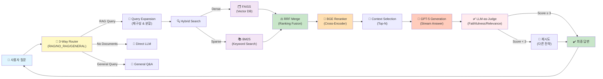
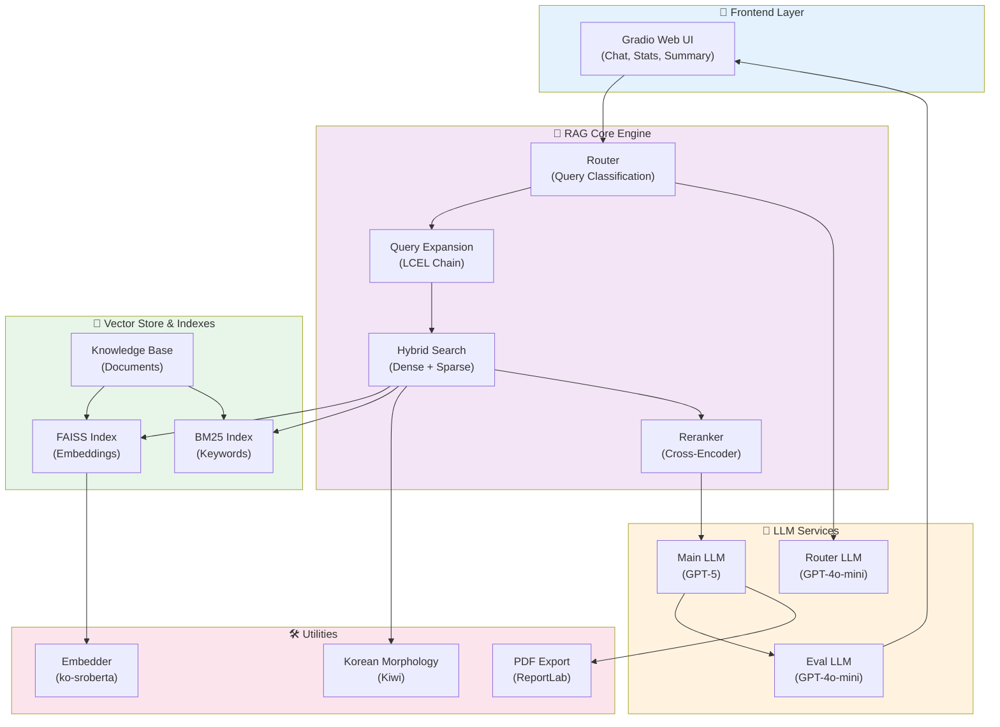
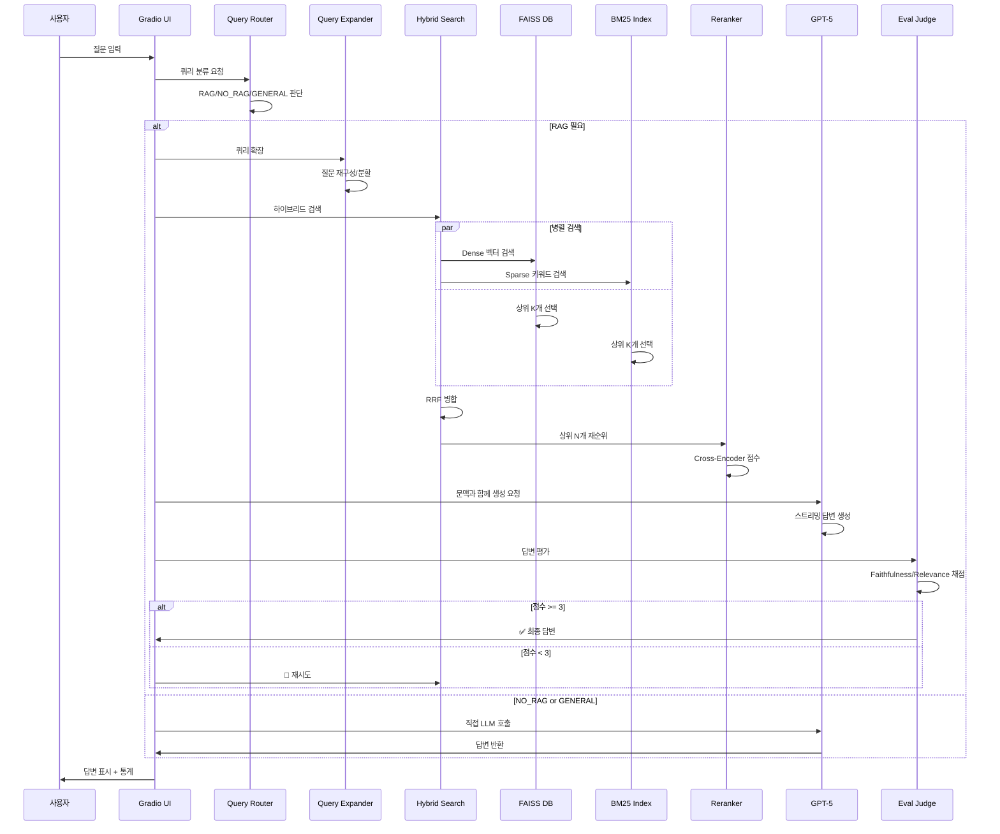

# scy_Rag - Portfolio RAG Chatbot

<div align="center">


**HR 담당자/채용 담당자를 위한 지능형 포트폴리오 분석 챗봇**

포트폴리오 문서에 대한 질문에 자연어로 답변하는 Retrieval-Augmented Generation (RAG) 기반 챗봇

[GitHub](https://github.com/song2mr/scy_ReadPortfolio_Agent) • [Demo](#demo) • [기술-스택](#-기술-스택)

</div>

---

## 📌 프로젝트 개요

**scy_Rag**는 후보자의 포트폴리오 문서를 지능적으로 분석하고, HR 담당자의 자연어 질문에 정확하고 신뢰할 수 있는 답변을 제공하는 AI 챗봇입니다.

### 핵심 가치
- **정확한 검색**: Dense + Sparse 하이브리드 검색 + 재순위 기능
- **다국어 지원**: 한국어 최적화 (KoSRoBERTa, Kiwi 형태소 분석)
- **신뢰성**: LLM-as-Judge 기반 자동 평가 및 재시도
- **사용 편의성**: 비밀번호 보호, 채팅 기록 관리, PDF 다운로드 지원

---

## 🏗️ 아키텍처 개요

### 전체 RAG 파이프라인



### 컴포넌트 상호작용 다이어그램



### 검색 및 생성 플로우



---

## 🛠️ 기술 스택

| 계층 | 기술 | 용도 | 버전 |
|------|------|------|------|
| **Frontend/UI** | Gradio | 웹 채팅 인터페이스 | 6.5+ |
| **Orchestration** | LangChain | RAG 파이프라인 (LCEL) | 1.2+ |
| **Main LLM** | OpenAI GPT-5 | 최종 답변 생성 | - |
| **Router LLM** | OpenAI GPT-4o-mini | 경량 라우팅/쿼리 확장 | - |
| **Embedding** | jhgan/ko-sroberta-multitask | 한국어 벡터화 (768-dim) | - |
| **Vector DB** | FAISS | Dense 벡터 검색 | - |
| **Reranker** | BAAI/bge-reranker-v2-m3 | Cross-Encoder 재순위 (다국어) | - |
| **Keyword Search** | BM25 + Kiwi | Sparse 검색 + 한국어 형태소 분석 | - |
| **Ranking Fusion** | RRF | Dense/Sparse 결과 병합 | - |
| **Document Loader** | PyPDF, Docx2txt, Google Drive | 포트폴리오 파일 로드 | - |
| **Chunking** | RecursiveCharacterTextSplitter | 문서 청크화 (800 chars, 150 overlap) | - |
| **PDF Export** | ReportLab | 한국어 PDF 생성 | - |
| **Tracing** | LangSmith (선택) | 디버깅 & 모니터링 | - |
| **Package Manager** | uv | 의존성 관리 | - |
| **CI/CD** | GitHub Actions | HuggingFace Spaces 자동 동기화 | - |

---

## 📂 프로젝트 구조

```
scy_Rag/
│
├── app.py                          # Gradio 엔트리포인트 (기본 시작점)
├── main.py                         # 최소화된 엔트리 (optional)
├── config.py                       # 중앙화된 설정 파일
├── requirements.txt                # Python 의존성
├── pyproject.toml                  # uv 프로젝트 설정
│
├── app/
│   ├── __init__.py
│   ├── app.py                      # Gradio UI 레이아웃 및 콜백
│   │                               #  - 채팅, 통계, 요약 다운로드
│   ├── rag.py                      # 핵심 RAG 파이프라인
│   │                               #  - Router, Query Expansion
│   │                               #  - Hybrid Search (Dense + Sparse)
│   │                               #  - Reranking, Generation
│   └── rag_eval.py                 # 평가 프롬프트 및 채점 로직
│
├── scripts/
│   ├── build_index.py              # 인덱스 생성 스크립트
│   │                               #  - PDF/DOCX → 청크 → 임베딩
│   │                               #  - FAISS + BM25 인덱스 빌드
│   └── evaluate_rag.py             # 독립적 평가 스크립트
│
├── data/
│   ├── candidate_profile.py        # 후보자 정보 & 쿼리 확장 주제
│   └── portfolio/                  # 포트폴리오 파일 저장소
│       ├── resume.pdf
│       ├── portfolio.docx
│       └── ...
│
├── index/                          # 생성된 인덱스
│   ├── faiss_index.bin             # FAISS 벡터 인덱스
│   ├── bm25_index.pkl              # BM25 인덱스
│   └── metadata.json               # 청크 메타데이터
│
├── .github/workflows/
│   └── hf_spaces_sync.yml          # HuggingFace Spaces 배포 자동화
│
└── README.md                       # 이 파일
```

---

## 🚀 빠른 시작 (Quick Start)

### 사전 요구사항
- Python 3.10 이상
- OpenAI API 키 (GPT-5, GPT-4o-mini)
- 4GB 이상의 RAM

### 설치

```bash
# 1. 저장소 클론
git clone https://github.com/song2mr/scy_ReadPortfolio_Agent.git
cd scy_Rag

# 2. 의존성 설치 (uv 사용)
uv pip install -r requirements.txt

# 또는 pip 사용
pip install -r requirements.txt

# 3. 환경변수 설정
cp .env.example .env
# .env 파일 편집: OpenAI API 키, 비밀번호 등 입력
```

### 포트폴리오 인덱싱

```bash
# 1. data/portfolio/ 디렉토리에 PDF/DOCX 파일 저장

# 2. 인덱스 빌드
python scripts/build_index.py

# 출력: index/ 디렉토리에 FAISS + BM25 인덱스 생성
```

### 애플리케이션 실행

```bash
# Gradio 웹 UI 시작
python app.py

# 또는
python main.py

# 출력: http://127.0.0.1:7860 (또는 지정된 포트)
```

### 웹 인터페이스 접근
1. 브라우저에서 `http://127.0.0.1:7860` 열기
2. 비밀번호 입력 (`.env`에서 설정한 값)
3. 포트폴리오에 대한 질문 입력

---

## ⚙️ 환경변수 설정

`.env` 파일 예제:

```bash
# OpenAI API
OPENAI_API_KEY=sk-...
OPENAI_ROUTER_MODEL=gpt-4o-mini
OPENAI_MAIN_MODEL=gpt-5
OPENAI_EVAL_MODEL=gpt-4o-mini

# 앱 설정
APP_PASSWORD=your_secure_password
APP_TITLE=포트폴리오 분석 챗봇
APP_PORT=7860

# RAG 파라미터
HYBRID_DENSE_K=7
HYBRID_SPARSE_K=7
HYBRID_MERGE_TOP_N=15
RERANKER_TOP_N=8
RRF_K=60

# 평가 설정
EVAL_MIN_FAITHFULNESS=3
EVAL_MIN_RELEVANCE=3
MAX_RETRY_ATTEMPTS=2
MAX_HISTORY_TURNS=5

# 청킹 파라미터
CHUNK_SIZE=800
CHUNK_OVERLAP=150

# LangSmith (선택)
LANGSMITH_API_KEY=
LANGSMITH_PROJECT=
```

**중요**: 실제 `.env` 파일은 절대 Git에 커밋하지 마세요. `.gitignore`에 추가되어 있습니다.

---

## 🔑 핵심 기능

### 1. 3-Way 라우팅
- **RAG**: 포트폴리오에서 정보를 검색하여 답변이 필요한 경우
- **NO_RAG**: 포트폴리오와 무관한 질문 (e.g., "날씨는?")
- **GENERAL**: 일반적인 조언이나 지식 질문

```python
# rag.py의 라우터 호출
route = await router_chain.ainvoke({"question": user_question})
# 반환: {"route": "rag"} | {"route": "no_rag"} | {"route": "general"}
```

### 2. 쿼리 확장 (Query Expansion)
- 사용자의 질문을 여러 하위 질문으로 재구성
- 검색 성능 향상 및 포괄적 답변 제공

```python
# Query Expansion 예시
입력: "이 사람의 경력과 기술은?"
출력: [
    "어떤 회사에서 일했는가?",
    "어떤 프로젝트를 담당했는가?",
    "주요 기술 스택은?"
]
```

### 3. 하이브리드 검색
- **Dense 검색** (FAISS): 의미 기반 유사성
- **Sparse 검색** (BM25): 키워드 매칭
- **RRF 병합**: 두 결과를 가중치 기반으로 병합

```
RRF Score = 1/(K + Dense_Rank) + 1/(K + Sparse_Rank)
K = 60 (기본값)
```

### 4. 재순위 (Reranking)
- Cross-Encoder 기반 정밀한 점수 계산
- 상위 N개만 선택하여 LLM 입력 최적화

### 5. 신뢰성 평가 (Evaluation)
- **Faithfulness**: 생성된 답변이 원문과 일치하는 정도 (1-5)
- **Relevance**: 답변이 사용자의 질문과 관련된 정도 (1-5)
- 점수 < 3일 경우 자동 재시도

### 6. 대화 이력 관리
- 최근 5턴까지 유지 (설정 가능)
- 문맥 기반 연속 답변 가능

### 7. 다운로드 기능
- **Markdown**: 채팅 내용 + 메타데이터
- **PDF**: 한국어 폰트 지원 (ReportLab)
- **TXT**: 순수 텍스트 형식

---

## 📊 성능 설정값

| 파라미터 | 값 | 설명 |
|---------|-----|------|
| `HYBRID_DENSE_K` | 7 | Dense 검색 상위 개수 |
| `HYBRID_SPARSE_K` | 7 | Sparse 검색 상위 개수 |
| `HYBRID_MERGE_TOP_N` | 15 | RRF 병합 후 선택할 개수 |
| `RERANKER_TOP_N` | 8 | 재순위 후 최종 선택 개수 |
| `RRF_K` | 60 | RRF 공식의 K 값 |
| `CHUNK_SIZE` | 800 | 문서 청크 크기 (문자) |
| `CHUNK_OVERLAP` | 150 | 청크 간 겹침 (문자) |
| `EVAL_MIN_FAITHFULNESS` | 3 | 최소 충실성 점수 |
| `EVAL_MIN_RELEVANCE` | 3 | 최소 관련성 점수 |
| `MAX_HISTORY_TURNS` | 5 | 유지할 대화 이력 턴 수 |

---

## 🔍 사용 예제

### 예제 1: 경력 조회
```
질문: "이 사람의 주요 경력을 설명해줄 수 있나요?"

시스템 동작:
1. Router: RAG로 분류
2. Query Expansion: "어떤 회사에 근무했나?", "직책은?", "근무 기간은?"
3. Hybrid Search: FAISS + BM25 검색
4. Reranking: 상위 문서 8개 선택
5. Generation: GPT-5로 스트리밍 답변
6. Evaluation: Faithfulness/Relevance 평가

답변: "이 지원자는 ABC Company에서 시니어 엔지니어로 3년 근무했으며,
      마이크로서비스 아키텍처 설계 및 팀 리드 경험이 있습니다..."
```

### 예제 2: 기술 스택 분석
```
질문: "어떤 프로그래밍 언어와 프레임워크를 사용했나요?"

답변: "Python, JavaScript, Go 언어 경험이 있으며,
      주로 Django, FastAPI, React 프레임워크를 사용했습니다..."
```

### 예제 3: 일반 질문
```
질문: "팀 협업에서 중요한 것은 무엇이라고 생각하나요?"

시스템 동작:
1. Router: GENERAL로 분류 (포트폴리오 정보 불필요)
2. Direct LLM: 직접 GPT-5 호출 (문맥 없음)

답변: "팀 협업에서 중요한 요소는..."
```

---

## 🔄 배포 (HuggingFace Spaces)

### GitHub Actions 자동 배포
`.github/workflows/hf_spaces_sync.yml` 파일을 통해 자동 배포 설정됨:

```yaml
# 매 푸시 또는 특정 브랜치 변경 시 자동 동기화
on:
  push:
    branches:
      - main
```

### 수동 배포
```bash
# 1. HuggingFace Spaces 저장소 추가
git remote add hf-spaces https://huggingface.co/spaces/your-username/scy-rag

# 2. 푸시
git push hf-spaces main
```

---

## 📈 모니터링 & 디버깅

### LangSmith 통합 (선택)
```bash
# 환경변수 설정
export LANGSMITH_API_KEY=...
export LANGSMITH_PROJECT=scy-rag

# 자동으로 모든 체인 호출이 LangSmith에 기록됨
```

### 로깅
```python
import logging
logging.basicConfig(level=logging.DEBUG)
logger = logging.getLogger(__name__)

# 각 파이프라인 단계의 상세 로그 확인 가능
```

---

## 🧪 평가 및 테스트

### 독립적 RAG 평가 실행
```bash
# 평가 데이터셋으로 전체 파이프라인 평가
python scripts/evaluate_rag.py \
    --eval_file data/eval_questions.json \
    --output results/eval_report.json
```

### 평가 지표
- **Retrieval Precision@K**: 상위 K개 문서 중 관련도
- **NDCG@K**: 정규화된 할인 누적 이득
- **Answer Faithfulness**: 생성 답변의 원문 일치도
- **Answer Relevance**: 질문과의 관련도

---

## 📝 라이선스

MIT License © 2024 Song Chan-young

---

## 👤 저자

**Song Chan-young (송찬영)**
- GitHub: [@song2mr](https://github.com/song2mr)
- Portfolio RAG Chatbot 개발자

---

## 🤝 기여

버그 리포트, 기능 제안, Pull Request 환영합니다!

1. Fork the repository
2. Create a feature branch (`git checkout -b feature/amazing-feature`)
3. Commit your changes (`git commit -m 'Add amazing feature'`)
4. Push to the branch (`git push origin feature/amazing-feature`)
5. Open a Pull Request

---

## 📚 참고 자료

### 핵심 기술 논문 & 문서
- [FAISS: Efficient Similarity Search](https://github.com/facebookresearch/faiss)
- [LangChain Documentation](https://python.langchain.com)
- [BGE Reranker](https://huggingface.co/BAAI/bge-reranker-v2-m3)
- [OpenAI API](https://platform.openai.com/docs)
- [Gradio Documentation](https://gradio.app)

### 한국어 NLP
- [KoSRoBERTa](https://github.com/jhgan/ko-sroberta-multitask)
- [Kiwi - Korean Morphological Analyzer](https://github.com/bab2min/Kiwi)

---

## ⚡ 성능 최적화 팁

### 검색 성능 향상
1. `CHUNK_SIZE` 조정: 더 작은 청크 = 더 정밀한 검색 (but 느림)
2. `HYBRID_MERGE_TOP_N` 감소: 빠른 처리 vs 정확도 트레이드오프
3. FAISS 인덱스 타입 변경: GPU 가속 가능

### 생성 품질 향상
1. 더 길게 저장된 대화 이력: `MAX_HISTORY_TURNS` 증가
2. Reranker Top-N 증가: 더 많은 문맥 제공
3. 프롬프트 엔지니어링: `rag.py`의 프롬프트 템플릿 개선

### 비용 절감
1. Router/Eval에 GPT-4o-mini 사용 (메인은 GPT-5)
2. 캐싱 활용: 동일한 쿼리는 캐시에서 반환
3. 배치 평가: 여러 답변을 한 번에 평가

---

## 🐛 알려진 이슈

| 이슈 | 상태 | 대안 |
|------|------|------|
| 긴 문서 처리 느림 | ⚠️ | 청크 크기 최적화, 병렬 처리 |
| 한국어 이모지 PDF 깨짐 | ⚠️ | 다른 폰트 사용 가능 |
| 메모리 과다 사용 | ⚠️ | `HYBRID_MERGE_TOP_N` 감소 |

---

## 🗺️ 향후 계획 (Roadmap)

- [ ] 다국어 지원 확대 (日本語, 中文, Spanish)
- [ ] GPU 가속 FAISS (RAFT)
- [ ] 웹훅 API 제공
- [ ] 대시보드 분석 기능 강화
- [ ] 실시간 문서 업데이트
- [ ] Fine-tuned 리렉터 모델

---

## 📧 문의

이슈 및 질문은 [GitHub Issues](https://github.com/song2mr/scy_ReadPortfolio_Agent/issues)에 작성해주세요.

---

<div align="center">

**⭐ 이 프로젝트가 도움이 되었다면 Star를 눌러주세요!**

Made with ❤️ by Song Chan-young

</div>
