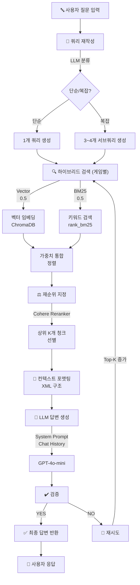
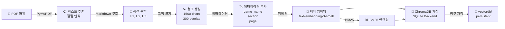
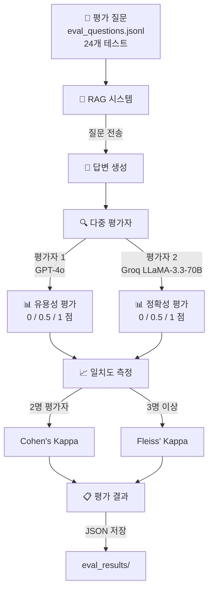

**GitHub 저장소:** https://github.com/song2mr/RAG_Boardgame_Rulebook

# Board Game Rulebook RAG System

<div align="center">


**고급 RAG 기반 보드게임 규칙 해석 챗봇**

게임별 고립된 지식 베이스를 통해 정확한 규칙 답변을 제공하는 멀티게임 RAG 시스템

[Features](#주요-기능) • [Architecture](#시스템-아키텍처) • [Quick Start](#빠른-시작) • [Tech Stack](#기술-스택)

</div>

---

## 📋 개요

이 프로젝트는 **Board Game Rulebook RAG (Retrieval-Augmented Generation) System**으로, 업로드된 PDF 규칙서로부터 보드게임 질문에 정확하게 답변하는 AI 챗봇입니다.

핵심 혁신:
- 🎯 **게임별 고립 저장소**: 각 게임의 규칙이 독립적으로 관리되어 게임 간 지식 혼동 방지
- 🔍 **하이브리드 검색**: 벡터 유사도(0.5) + BM25 키워드 검색(0.5)의 가중치 통합
- 📚 **다단계 재순위 지정**: Cohere reranker를 통한 정확한 컨텍스트 선별
- ✅ **자동 검증 및 재시도**: LLM 기반 답변 품질 검증 및 동적 최적화
- 📊 **평가 시스템**: 다중 평가자(GPT + Groq)와 Cohen's/Fleiss' Kappa 일치도 측정

---

## 🎮 주요 기능

| 기능 | 설명 |
|------|------|
| **다중 게임 지원** | 16개 이상의 보드게임 규칙서 동시 관리 |
| **지능형 쿼리 재작성** | LLM이 단순/복잡 질문 분류 후 1~4개 서브쿼리 생성 |
| **하이브리드 검색** | 벡터 임베딩 + BM25 BM25 키워드 검색의 최적 조합 |
| **동적 재순위 지정** | Cohere reranker로 관련성 높은 청크 우선순위 |
| **출처 인용** | 게임명, 섹션, 페이지 정보와 함께 답변 제공 |
| **멀티턴 대화** | 최대 20턴 대화 이력 관리(2000 토큰 제한) |
| **게임 관리 UI** | Gradio 기반 드롭다운으로 게임 선택 및 추가/제거 |
| **배치 PDF 수집** | 여러 PDF를 한 번에 처리 및 저장 |
| **평가 파이프라인** | 자동화된 답변 품질 평가 및 메트릭 계산 |

---

## 🏗️ 시스템 아키텍처

### RAG 파이프라인 흐름



**파이프라인 단계 상세:**
1. **쿼리 재작성**: 단순 질문은 그대로, 복잡한 질문은 3~4개 서브쿼리로 분해
2. **멀티쿼리 하이브리드 검색**: 각 쿼리마다 벡터+BM25 검색, 게임별 메타데이터 필터링
3. **재순위 지정**: Cohere reranker로 관련성 재평가 및 커버리지 보장
4. **컨텍스트 포맷팅**: XML 구조로 소스 정보와 함께 정렬
5. **LLM 답변**: 룰북 전문가 시스템 프롬프트 + 최대 20턴 대화 이력
6. **검증**: LLM YES/NO 체크로 답변 품질 확인
7. **재시도**: 검증 실패 시 top_k 증가 후 재검색 (최대 1회)

---

### 데이터 수집(Ingestion) 파이프라인



**수집 상세:**
- **PDF 파싱**: PyMuPDF로 컬럼 인식 블록 기반 추출
- **섹션 분할**: Markdown 헤딩(#, ##, ###) 기반 계층적 분할
- **청킹**: 1500자 고정 크기, 300자 중복(테이블 보존)
- **메타데이터**: game_name, section, page, source_file 기록
- **저장소**: ChromaDB 영구 저장소(SQLite 백엔드) + BM25 인덱스

---

### 평가 시스템 흐름



**평가 메커니즘:**
- **평가 질문**: eval_questions.jsonl에서 24개 테스트 질문 로드
- **다중 평가자**: GPT-4o (주 평가자) + Groq LLaMA-3.3-70B (보조)
- **평가 지표**: 유용성(0/0.5/1), 정확성(0/0.5/1)
- **일치도**: Cohen's Kappa (2명), Fleiss' Kappa (3명 이상)
- **결과 저장**: eval_results/ 디렉토리에 JSON 형식 저장

---

## 🛠️ 기술 스택

| 계층 | 기술 | 용도 |
|------|------|------|
| **UI** | Gradio | 챗봇 인터페이스, 파일 업로드, 게임 관리 |
| **LLM** | OpenAI GPT-4o-mini | 답변 생성, 쿼리 재작성, 검증 |
| **임베딩** | OpenAI text-embedding-3-small | 의미론적 검색 |
| **재순위** | Cohere rerank-v3.5 (API) | 검색 결과 재순위 |
| **재순위 백업** | BAAI/bge-reranker-v2-m3 (Local) | 로컬 폴백 |
| **벡터 DB** | ChromaDB | 의미론적 검색 + 영구 저장 |
| **키워드 검색** | rank_bm25 | 어휘 기반 검색 |
| **PDF 처리** | PyMuPDF | 컬럼 인식 텍스트 추출 |
| **프레임워크** | LangChain | RAG 체인 구성 |
| **평가자** | Groq (LLaMA-3.3-70B) | 보조 평가 |
| **통계** | scikit-learn, statsmodels | Kappa 계산 |
| **패키지 관리** | uv | 고속 의존성 관리 |

---

## 🚀 빠른 시작

### 사전 요구사항
- Python 3.9+
- OpenAI API 키
- Cohere API 키 (선택사항, 로컬 재순위 폴백 가능)
- Groq API 키 (평가 시스템 전용)

### 설치

```bash
# 저장소 클론
git clone <repository-url>
cd Boardgame_rule

# 패키지 설치 (uv 사용)
uv sync

# 또는 pip 사용
pip install -r requirements.txt
```

### 환경 변수 설정

프로젝트 루트에 `.env` 파일을 생성하세요:

```env
# OpenAI 설정
OPENAI_API_KEY=sk-proj-...
OPENAI_EMBEDDING_MODEL=text-embedding-3-small
OPENAI_LLM_MODEL=gpt-4o-mini

# Cohere 설정 (선택사항)
COHERE_API_KEY=...

# Groq 설정 (평가 시스템)
GROQ_API_KEY=...
GROQ_MODEL=llama-3.3-70b-versatile

# 애플리케이션 설정
VECTORDB_PATH=./vectordb
CHUNK_SIZE=1500
CHUNK_OVERLAP=300
INITIAL_TOP_K=10
FINAL_TOP_K=6
MAX_RETRIES=1
HYBRID_WEIGHT_VEC=0.5
HYBRID_WEIGHT_BM25=0.5
MAX_HISTORY_TURNS=20
CHAT_HISTORY_MAX_TOKENS=2000
```

### 애플리케이션 실행

```bash
# Gradio 웹 인터페이스 시작
python -m src.app

# 브라우저에서 http://localhost:7860 접속
```

### PDF 수집(Ingestion)

```bash
# 단일 PDF 수집
python ingest.py --pdf rulebooks/스플렌더.pdf --game 스플렌더

# 배치 수집 (모든 PDF)
python ingest.py --batch

# 게임 확인
python check_db.py

# 누락된 게임 등록
python register_missing.py --game 루미큐브
```

### 평가 시스템 실행

```bash
# RAG 답변으로 평가 샘플 생성
python scripts/fill_eval_from_rag.py

# 평가 실행
python src/evaluation/run_eval.py

# 결과 확인
# → eval_results/ 디렉토리의 JSON 파일 참고
```

---

## 📊 구성 하이라이트

주요 설정값 (`src/config.py`):

```python
# 청킹 파라미터
CHUNK_SIZE = 1500              # 청크 최대 크기 (문자)
CHUNK_OVERLAP = 300            # 청크 중복 (문자)

# 검색 파라미터
INITIAL_TOP_K = 10             # 초기 검색 결과
FINAL_TOP_K = 6                # 최종 재순위 결과

# 모델 설정
USE_RERANKER = True            # Cohere 재순위 사용
MAX_RETRIES = 1                # 최대 재시도 횟수

# 하이브리드 검색 가중치
HYBRID_WEIGHT_VEC = 0.5         # 벡터 가중치
HYBRID_WEIGHT_BM25 = 0.5        # BM25 가중치

# 대화 이력
MAX_HISTORY_TURNS = 20          # 최대 턴 수
CHAT_HISTORY_MAX_TOKENS = 2000  # 최대 토큰
```

---

## 📁 프로젝트 구조

```
Boardgame_rule/
├── ingest.py                          # CLI 배치/단일 PDF 수집
├── check_db.py                        # PDF vs 등록 게임 비교
├── register_missing.py                # 특정 게임 등록
├── test_import.py                     # 성능 프로파일링
│
├── src/
│   ├── config.py                      # 중앙 설정 관리
│   ├── document_loader.py             # PDF → 텍스트(컬럼인식) → 청크
│   ├── vectorstore.py                 # ChromaDB + 하이브리드 검색
│   ├── chain.py                       # RAG 파이프라인
│   │                                  # (재작성 → 검색 → 재순위 → LLM → 검증 → 재시도)
│   ├── app.py                         # Gradio UI
│   │                                  # (챗봇, 파일 업로드, 게임 관리)
│   ├── router.py                      # (미래) 게임 자동 추론
│   ├── reload_game.py                 # 게임 재청킹
│   ├── inspect_chunks.py              # 청크 검사 및 디버깅
│   │
│   └── evaluation/
│       ├── prompts.py                 # 평가 프롬프트
│       │                              # (유용성 + 정확성)
│       ├── evaluators.py              # GPT/Groq 평가자
│       ├── agreement.py               # Cohen's/Fleiss' Kappa
│       └── run_eval.py                # 평가 실행 메인
│
├── scripts/
│   └── fill_eval_from_rag.py          # RAG에서 평가 샘플 생성
│
├── data/
│   ├── rulebooks/                     # 16개 보드게임 PDF
│   ├── eval_questions.jsonl           # 24개 테스트 질문
│   └── eval_samples.jsonl             # 생성된 평가 데이터
│
├── eval_results/                      # 평가 결과 JSON
├── vectordb/                          # ChromaDB 영구 저장소
├── docs/
│   ├── RAG_ARCHITECTURE.md            # Mermaid 다이어그램
│   └── architecture_diagram.md        # 아키텍처 설명
│
├── pyproject.toml                     # uv 프로젝트 설정
├── requirements.txt                   # pip 의존성
├── .env.example                       # 환경 변수 템플릿
└── README.md                          # 이 파일
```

---

## 🎮 지원 게임 (16개+)

| 게임명 | PDF | 상태 |
|--------|-----|------|
| 기즈모 | ✓ | 활성 |
| 도망자 | ✓ | 활성 |
| 레디셋벳 | ✓ | 활성 |
| 루미큐브 | ✓ | 활성 |
| 세븐원더스듀얼 | ✓ | 활성 |
| 스플렌더 | ✓ | 활성 |
| 시타델 | ✓ | 활성 |
| 아크노바 | ✓ | 활성 |
| 카탄 | ✓ | 활성 |
| 캐널하우스 | ✓ | 활성 |
| 커피러시 | ✓ | 활성 |
| 포션폭발 | ✓ | 활성 |
| 항해 | ✓ | 활성 |
| 화이트채플에서온편지 | ✓ | 활성 |

---

## 🔑 핵심 설계 결정

### 1. 게임별 고립 저장소
각 게임의 규칙이 별도 컬렉션으로 관리되어 지식 혼동 방지:
```python
# ChromaDB 컬렉션명: f"{game_name}"
collection = client.get_or_create_collection(
    name=game_name,
    metadata={"hnsw:space": "cosine"}
)
```

### 2. 하이브리드 검색 (벡터 + BM25)
- **벡터 검색**: 의미론적 유사도 (ChromaDB)
- **BM25**: 정확한 키워드/용어 매칭 (rank_bm25)
- **통합**: 0.5:0.5 정규화 가중치로 균형 잡힘

```python
# Normalized Score = (vec_score * 0.5) + (bm25_score * 0.5)
```

### 3. 동적 재순위 지정
Cohere reranker로 최종 청크 선택, 쿼리 커버리지 보장:
```python
# top_k=6으로 최종 정제하여 컨텍스트 윈도우 최적화
```

### 4. 검증 및 재시도 루프
LLM이 답변 품질을 YES/NO로 판정, 실패 시 top_k 증가:
```python
# 검증 실패 → top_k: 10 → 15 → 재검색 → 재생성
```

### 5. 멀티턴 대화 이력
최대 20턴, 2000 토큰으로 제한하여 컨텍스트 효율성 유지

---

## 📈 성능 및 평가

### 평가 메트릭
- **유용성 (Usefulness)**: 사용자 질문에 실질적 도움 여부 (0/0.5/1)
- **정확성 (Accuracy)**: 규칙서와 일치하는 정도 (0/0.5/1)
- **Cohen's Kappa**: 2명 평가자 일치도
- **Fleiss' Kappa**: 3명 이상 평가자 일치도

### 실행 방법
```bash
# 평가 샘플 생성
python scripts/fill_eval_from_rag.py

# 평가 실행
python src/evaluation/run_eval.py

# 결과 확인
cat eval_results/evaluation_results_*.json | jq .
```

---

## 🔧 트러블슈팅

### ChromaDB 연결 오류
```bash
# 벡터DB 재초기화
rm -rf vectordb/
python ingest.py --batch
```

### Cohere API 오류
```python
# 로컬 백업 재순위 자동 사용
# config.py에서 USE_LOCAL_RERANKER=True로 설정
```

### 메모리 부족
```python
# config.py 조정
CHUNK_SIZE = 1000  # 더 작게
INITIAL_TOP_K = 5  # 더 적게
```

---

## 📝 사용 예시

### 웹 인터페이스
1. Gradio 대시보드에서 게임 선택 (드롭다운)
2. 질문 입력 (예: "카탄에서 정착촌 건설 비용은?")
3. 엔터 또는 제출 버튼 클릭
4. RAG 파이프라인이 규칙서에서 답변 생성
5. 출처 정보(게임명, 섹션, 페이지) 함께 표시

### 프로그래밍 인터페이스
```python
from src.chain import RAGChain
from src.config import Config

config = Config()
chain = RAGChain(config=config)

response = chain.invoke(
    question="루미큐브에서 조커 타일 사용 규칙은?",
    game_name="루미큐브"
)

print(response["answer"])
print(response["sources"])
```

---

## 📚 문서

- `docs/RAG_ARCHITECTURE.md`: 상세 아키텍처 설명 + Mermaid 다이어그램
- `docs/architecture_diagram.md`: 시각적 아키텍처 개요
- `src/config.py`: 모든 설정 파라미터 주석
- 평가 시스템: `src/evaluation/` 디렉토리의 인라인 주석

---

## 👤 저자

**Song Chan-young (송찬영)**

---

## 📄 라이선스

이 프로젝트는 MIT 라이선스 하에 배포됩니다. 자세한 내용은 LICENSE 파일을 참고하세요.

---

## 🙏 감사의 말

- OpenAI (GPT-4o-mini, text-embedding-3-small)
- Cohere (rerank-v3.5)
- Groq (LLaMA-3.3-70B)
- LangChain (RAG 프레임워크)
- ChromaDB (벡터 스토리지)
- Gradio (UI 프레임워크)

---

<div align="center">

**⭐ 이 프로젝트가 도움이 되었다면 Star를 눌러주세요!**

Made with ❤️ for board game enthusiasts

</div>
