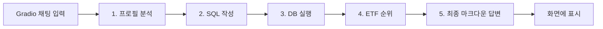

---
title: 맞춤형 ETF 추천 어시스턴트
emoji: 📈
colorFrom: indigo
colorTo: gray
sdk: gradio
sdk_version: "5.34.2"
app_file: app.py
---

**GitHub 저장소:** https://github.com/song2mr/etf_recommendation

# 맞춤형 ETF 추천 어시스턴트 (Gradio)

사용자가 한국어로 질문하면, **투자 프로필 → SQL 검색 → 순위 → 최종 설명**까지 한 줄기 파이프라인(LangGraph)으로 처리하는 챗봇입니다.

---

## 앱이 도는 순서 (한눈에)

사용자 메시지는 **항상 같은 순서의 5단계**를 거칩니다. 분기나 루프 없이 **직선 플로우**입니다.



---

## 시작할 때 한 번 일어나는 일 (앱 기동)

앱을 켜면 **질문 처리 전에** 아래가 먼저 준비됩니다.

1. **SQLite `etf_database.db`**에 연결합니다. 이후 모든 ETF 데이터 조회는 이 DB를 통합니다.
2. DB에서 **종목명·운용사·기초지수** 목록을 뽑아, 임베딩으로 **메모리 벡터 저장소**를 만듭니다.
3. **`search_proper_nouns` 도구**가 이 저장소를 검색합니다. 사용자 표현과 DB에 있는 고유명사(종목명 등)를 맞출 때 쓰입니다.

즉, **“DB 스키마 + 고유명사 힌트”**가 미리 깔려 있는 상태에서 질문이 들어옵니다.

---

## 질문이 들어온 뒤: LangGraph 상태 흐름

한 번의 질문마다 그래프는 공통 **`State`** 딕셔너리를 채워 나갑니다. 필드 의미는 대략 다음과 같습니다.

| 상태 필드 | 무엇이 들어가는지 |
|-----------|-------------------|
| `question` | 사용자 원문 질문 |
| `user_profile` | LLM이 뽑은 투자 프로필(위험·기간·목표·섹터·월 투자액 등) |
| `query` | LLM이 생성한 SQL 문자열 |
| `candidates` | SQL 실행 결과(후보 ETF 텍스트) |
| `rankings` | 상위 ETF에 대한 순위·점수·이유 구조체 목록 |
| `final_answer` | 표·섹션으로 정리된 마크다운 답변 등 |

---

## 단계별로 무엇이 일어나는지

### 1) `analyze_profile`

- 입력: `question`
- **GPT(구조화 출력)**가 질문만 보고 `InvestmentProfile` 형태로 프로필을 채웁니다.
- 출력: `user_profile` (위험 성향, 투자 기간, 목표, 선호/제외 섹터, 월 투자액 등)

이후 모든 단계는 이 프로필을 “사용자 조건”으로 참고합니다.

### 2) `write_query`

- 입력: `question`, `user_profile`, 그리고 **DB 메타데이터**
- SQL을 짤 때 **`entity_retriever_tool`**을 한 번 호출합니다. 사용자 질문과 비슷한 **실제 DB에 있는 종목명·운용사·기초지수** 후보를 가져와, 프롬프트의 “Entity relationships”에 넣습니다.
- **GPT(구조화 출력)**가 SQLite용 `SELECT` 문과 한국어 설명을 만듭니다.
- 출력: `query`, `explanation`(쿼리 의도 설명)

### 3) `execute_query`

- 입력: `query`
- LangChain의 **`QuerySQLDatabaseTool`**로 SQL을 그대로 실행합니다.
- 출력: `candidates` (후보 ETF 행들을 문자열 형태로 받은 것)

여기서부터는 “DB에서 걸러진 후보 집합”이 고정됩니다.

### 4) `rank_etfs`

- 입력: `user_profile`, `candidates`
- **GPT(구조화 출력)**가 후보를 사용자 프로필에 맞게 점수화하고 **상위 순위**(코드·이름·점수·한국어 순위 이유)를 만듭니다.
- 출력: `rankings`

### 5) `generate_explanation`

- 입력: `user_profile`, `rankings`
- **GPT(구조화 출력)**가 포트폴리오 개요, ETF별 비중·설명·포인트·리스크, 전체 고려사항을 채웁니다.
- 내부에서 `to_markdown()`으로 **표와 섹션이 있는 마크다운**으로 변환합니다.
- 출력: `final_answer` (구조화 데이터 + `markdown` 문자열)

Gradio는 이 **`final_answer["markdown"]`**만 사용자에게 보여 줍니다.

---

## Gradio와 그래프의 연결

- 채팅 UI에서 메시지가 오면 `answer_invoke` → `process_message`가 호출됩니다.
- `process_message`는 **`graph.invoke({"question": message})`** 한 번으로 위 1~5를 순서대로 실행합니다.
- 예외가 나면 오류 메시지 블록을 문자열로 돌려줍니다.

---

## 구성 파일 역할 (요약)

| 파일 | 역할 |
|------|------|
| `app.py` | DB 연결, 벡터 검색 도구, LangGraph 정의, Gradio `ChatInterface` |
| `etf_database.db` | ETF 테이블 데이터 (SQL 단계의 사실 근거) |
| `requirements.txt` | Gradio, LangChain, LangGraph, OpenAI 연동 등 의존성 |

`etf_database.db`는 저장소에서 **Git LFS**로 관리합니다. Hugging Face Hub는 일반 바이너리 직접 푸시를 막기 때문에, LFS 포인터로 두는 방식입니다. 클론 후에는 `git lfs pull`로 실제 DB 파일을 받는 환경이면 됩니다.

---

## 기술 스택 (참고)

- **Gradio** — 채팅 UI  
- **LangGraph** — 위 5노드 직선 그래프 오케스트레이션  
- **LangChain** — 프롬프트, SQL 도구, OpenAI·임베딩 연동  
- **SQLite** — 후보 ETF 조회의 단일 데이터 소스  

## 설치·실행

```powershell
cd Week3\gradio
python -m venv .venv
.\.venv\Scripts\Activate.ps1
pip install -r requirements.txt
python app.py
```

## 질문 팁

**투자 목적, 기간, 위험 성향, 선호/제외 섹터, 월 투자 가능 금액**을 질문에 넣을수록 프로필 단계가 안정적이고, 이후 SQL·순위·설명이 그 프로필에 맞춰집니다.
