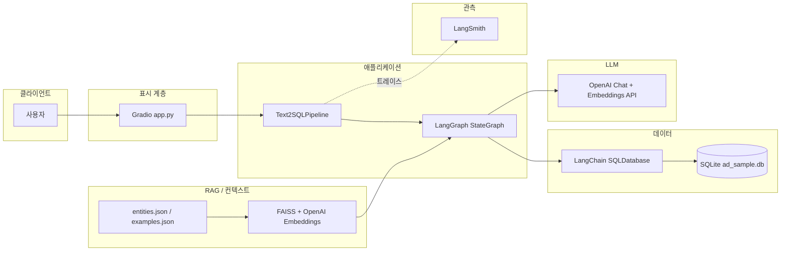
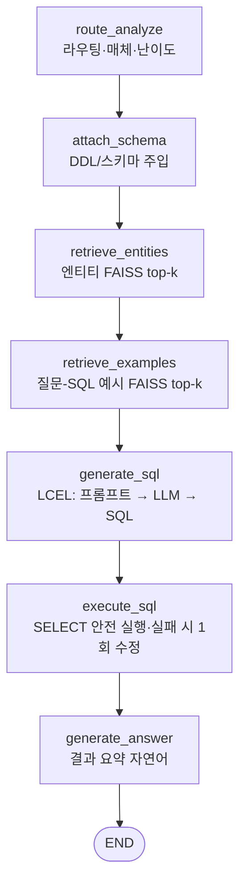
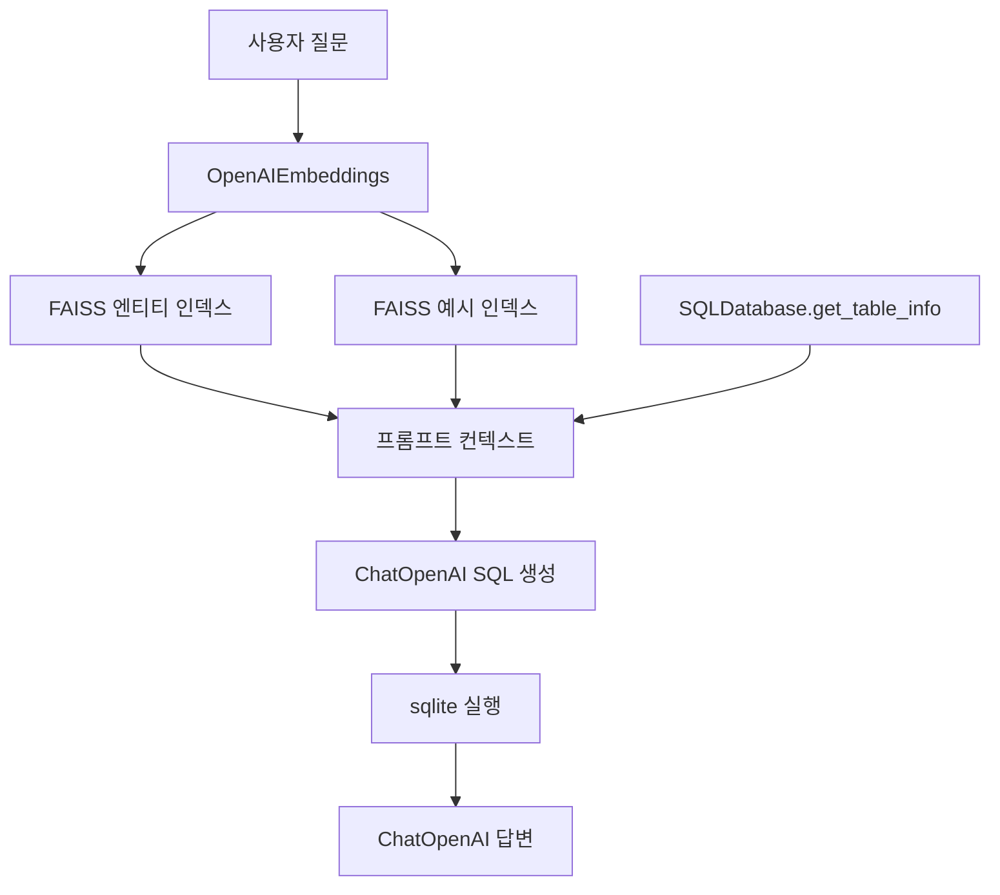
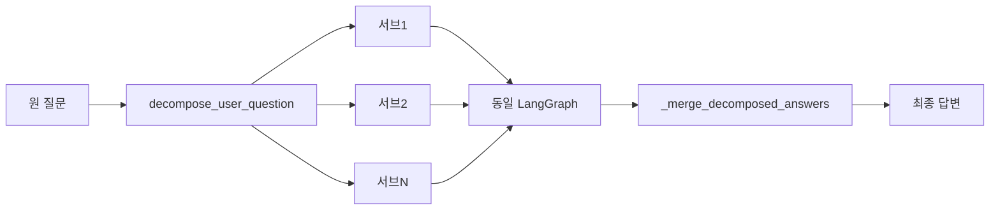

**GitHub 저장소:** https://github.com/song2mr/text-to-sql-marketing_data-

# Text2SQL Learning Pipeline (SQLite)

LangChain + LangSmith + LangGraph 기반 **학습용 Text-to-SQL** 예제입니다.  
실제 운영 DB 대신 로컬 **SQLite** 샘플(네이버·카카오 광고 스키마)을 사용합니다.

**라우팅**: `text_to_sql_routing_guide.md`에 따라 매체 감지 → 쿼리 유형·난이도 → 시스템 프롬프트·정적 Few-shot 선택 후 SQL을 생성합니다.

**LangSmith**: `LANGSMITH_API_KEY`와 트레이싱 설정으로 그래프 노드·`@traceable` 단계(`routing:*`, `graph:*`, `sql:*`, `nlp:*`)가 스팬으로 기록됩니다.

**질문 분해**: Gradio에서 체크 시 LLM이 복합 질문을 서브 질문으로 나누고, 서브마다 동일 그래프를 돌린 뒤 결과를 이어 **통합 답변**을 만듭니다.

---

## 아키텍처 개요

사용자 → **Gradio UI** → **Text2SQL 파이프라인** → **OpenAI(API)** · **SQLite** · **메모리 내 FAISS** 가 연결됩니다.



---

## LangGraph 파이프라인 (단일 질문)

한 번의 질의는 아래 **고정 순서**의 노드로 실행됩니다. (질문 분해 모드에서는 서브 질문마다 이 그래프를 반복 호출합니다.)



---

## RAG·데이터 흐름

검색 모드(`basic` / `fewshot` / `entity_fewshot`)에 따라 **엔티티·예시** 노드는 스킵하거나 FAISS 검색을 수행합니다.



---

## 질문 분해(옵션) 흐름

Gradio에서 분해를 켜면 **먼저** 서브 질문 리스트를 LLM으로 만든 뒤, 각 서브 질문에 대해 위 LangGraph를 실행하고 마지막에 **통합 요약** LLM 호출이 추가될 수 있습니다.



---

## 기술 스택 상세

이 저장소의 **Text-to-SQL 코드**(`src/text_to_sql/`, `app.py`)가 실제로 쓰는 계층을 기준으로 정리했습니다. 전체 패키지 목록은 **`pyproject.toml`** / **`uv.lock`** 을 보시면 됩니다.

| 구분 | 기술 | 역할 |
|------|------|------|
| **언어·런타임** | Python 3.13+ (`requires-python`) | 앱·스크립트 실행 |
| **패키지 관리** | [uv](https://github.com/astral-sh/uv), `uv.lock` | 의존성 잠금·재현 가능한 설치 |
| **UI** | [Gradio](https://www.gradio.app/) | 질의 입력, 단일/3모드 비교, SQL·결과·디버그 JSON 표시 |
| **오케스트레이션** | [LangGraph](https://github.com/langchain-ai/langgraph) `StateGraph` | 라우팅→스키마→RAG→SQL→실행→답변 노드 순서 고정, 상태(`GraphState`) 전달 |
| **LLM 추상화** | [LangChain](https://python.langchain.com/) Core | `ChatPromptTemplate`, `StrOutputParser`, LCEL(`prompt \| llm \| parser`)로 SQL·답변·분해 체인 구성 |
| **모델 제공** | [langchain-openai](https://pypi.org/project/langchain-openai/) | `ChatOpenAI`(채팅), `OpenAIEmbeddings`(벡터 검색용 임베딩) — OpenAI API 호출 |
| **DB 도구** | [langchain-community](https://pypi.org/project/langchain-community/) `SQLDatabase` | SQLite URI 연결, 스키마 요약(`get_table_info`), `run()`으로 쿼리 실행 문자열 반환 |
| **벡터 검색** | [FAISS](https://github.com/facebookresearch/faiss) (LangChain `FAISS` 래퍼) | `entities.json`·`examples.json`을 기동 시 메모리 인덱스로 구축, 질문 임베딩 기준 **top-k** 유사도 검색 |
| **문서 모델** | LangChain `Document` | JSON 레코드를 `page_content` + `metadata`로 변환해 임베딩·검색 |
| **데이터 저장** | SQLite (`sqlite3`), [pandas](https://pandas.pydata.org/) | 데모 DB·CSV→DB 적재 스크립트(`db.py`의 선택 유틸) |
| **설정** | [python-dotenv](https://pypi.org/project/python-dotenv/) | `.env`에서 API 키·모델명·DB 경로 로드 (`config.py`) |
| **관측·디버깅** | [LangSmith](https://www.langchain.com/langsmith) | `@traceable`, 노드별 `run_type`으로 SQL 실행·수정·NL 생성 스팬 분리 |

### 동작을 한 줄로 요약하면

1. **라우팅**(규칙+LLM 요약): 질문에서 매체·질의 유형 등을 잡고 정적 Few-shot·시스템 문구를 고릅니다.  
2. **스키마**: LangChain `SQLDatabase`로 테이블 DDL 요약을 프롬프트에 넣습니다.  
3. **RAG**(모드에 따라): OpenAI 임베딩 + FAISS로 엔티티·질문-SQL 예시를 가져와 SQL 생성 품질을 보조합니다.  
4. **SQL**: LLM이 `SELECT`/`WITH … SELECT`만 허용되도록 검증 후 실행하고, 오류 시 **1회** 수정 LLM 호출(`traced_sql.repair_sql_with_llm`).  
5. **답변**: 실행 결과 문자열을 바탕으로 한국어 자연어 답변을 생성합니다.

---

## 1) 환경 변수

`.env`에 아래 값을 준비합니다.

```env
OPENAI_API_KEY=...
LANGSMITH_API_KEY=...
LANGSMITH_TRACING=true
LANGCHAIN_TRACING_V2=true
LANGSMITH_PROJECT=text2sql-learning
OPENAI_MODEL=gpt-4o-mini
# optional: default is data/ad_sample.db
# SQLITE_DB_PATH=C:\path\to\your.db
```

`LANGCHAIN_TRACING_V2`를 빼도, 앱 기동 시 `ensure_langsmith_env()`가 기본값 `true`를 넣어 LangGraph/LangChain 실행이 LangSmith에 남도록 합니다.

## 2) 데이터베이스

마케팅 샘플 DB는 **`build_ad_db.ipynb`**에서 `data/*.csv` → **`data/ad_sample.db`** 로 생성합니다.  
앱은 이 파일을 그대로 읽으며, 실행 시 CSV로 DB를 다시 만들지 않습니다.

다른 경로를 쓰려면 `.env`에 `SQLITE_DB_PATH=...` 를 지정하세요.

DB 존재 여부만 빠르게 확인:

```bash
uv run python scripts/init_sqlite_demo.py
```

## 3) 데모 실행

```bash
uv run --env-file .env -- python scripts/run_text2sql_demo.py
```

## 4) 비교 평가 실행

```bash
uv run --env-file .env -- python scripts/evaluate_text2sql.py
```

- 비교 모드
  - `basic`: 예시/엔티티 검색 없음
  - `fewshot`: 예시 검색만 사용
  - `entity_fewshot`: 엔티티 + 예시 검색 둘 다 사용

## 5) Gradio UI 실행

```bash
uv run --env-file .env -- python app.py
```

- 기본 주소: **http://127.0.0.1:7860** (터미널에 `>>> Gradio 시작:` 으로도 출력됩니다.)
- **페이지가 안 열리면**: 위 명령을 실행한 **터미널을 그대로 둔 채** 접속해야 합니다. 명령을 안 돌리면 서버가 없어 7860이 비어 있습니다.
- 7860 포트 충돌 시: `GRADIO_SERVER_PORT=7861` 등으로 바꿔 실행하거나, 터미널에 Gradio가 찍어 준 `Running on local URL: ...` 주소를 사용하세요.
