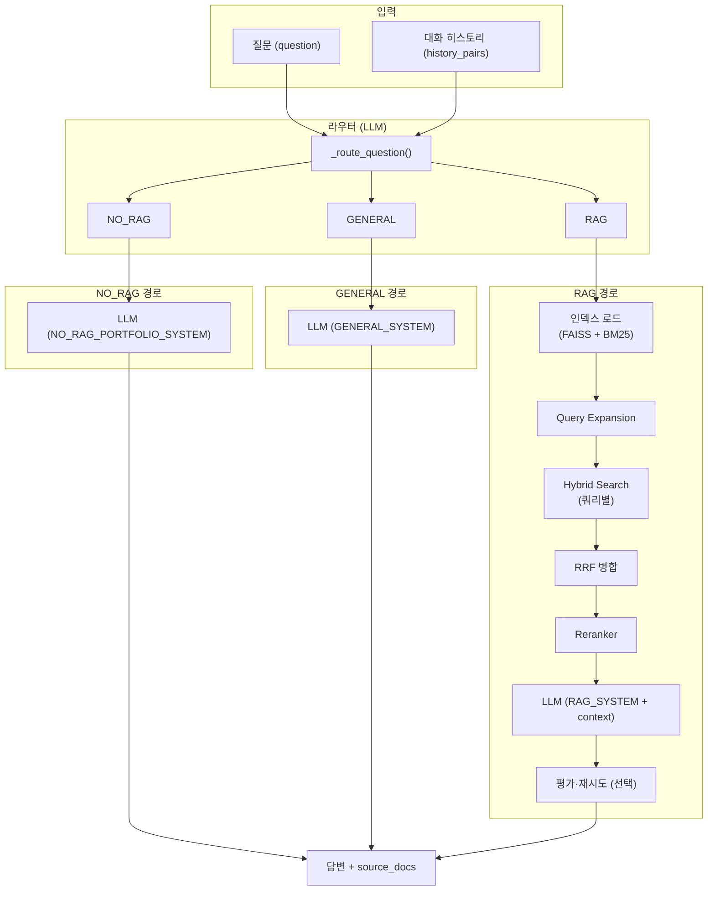
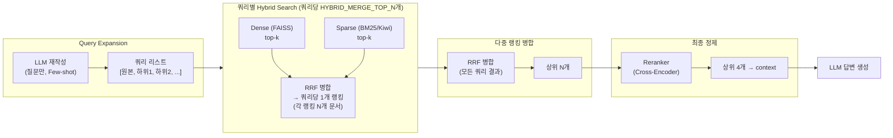
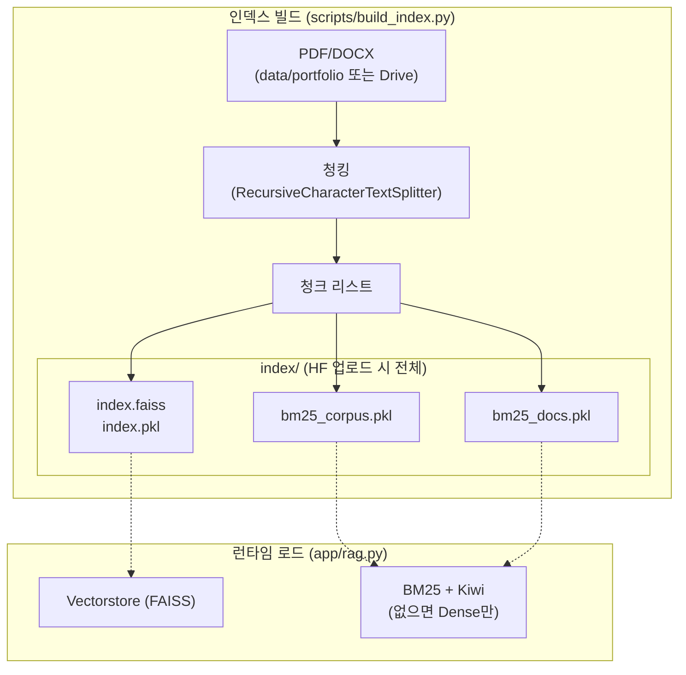

# RAG 전체 구조 (Mermaid)

## 1. 요청~응답 흐름 (flowchart)

## 2. RAG 경로 상세 (Query Expansion → Hybrid → RRF → Reranker)

- **Query Expansion**: 1차 검색 없이 **질문만** LLM에 넣어 재작성. 단일 → 1줄, 포괄적 → 2~4개 하위 질문.
- **쿼리당 문서 수**: 각 쿼리마다 Hybrid Search(Dense + Sparse) 후 RRF로 **쿼리당 `HYBRID_MERGE_TOP_N`개**(예: 15개) 문서를 가져옴. 그 다음 여러 쿼리의 랭킹을 다시 RRF로 병합해 최종 15개 → Reranker → 4개.

## 3. 데이터/인덱스 구조

## 4. 컴포넌트 요약

| 구분 | 내용 |
|------|------|
| **라우터** | LLM 1회 호출 → RAG / NO_RAG / GENERAL (대화 히스토리 참고) |
| **Query Expansion** | 1차 검색 없음. 질문만으로 LLM 재작성(Few-shot). 단일 → 1줄, 포괄적 → 2~4개 하위 질문 |
| **쿼리당 문서 수** | 각 쿼리마다 Hybrid Search 후 RRF로 **HYBRID_MERGE_TOP_N개**(예: 15개). 이 랭킹들을 다시 RRF 병합 |
| **Hybrid (쿼리당)** | Dense(FAISS) top-k + Sparse(BM25/Kiwi) top-k → RRF로 하나의 랭킹 |
| **RRF** | 여러 쿼리의 랭킹을 RRF로 병합 → 상위 HYBRID_MERGE_TOP_N개 |
| **Reranker** | Cross-Encoder(bge-reranker-v2-m3) → 상위 RERANKER_TOP_N(4)개만 LLM에 전달 |
| **평가·재시도** | Faithfulness/Relevance 낮으면 k 늘려 1회 재검색·재생성 |
